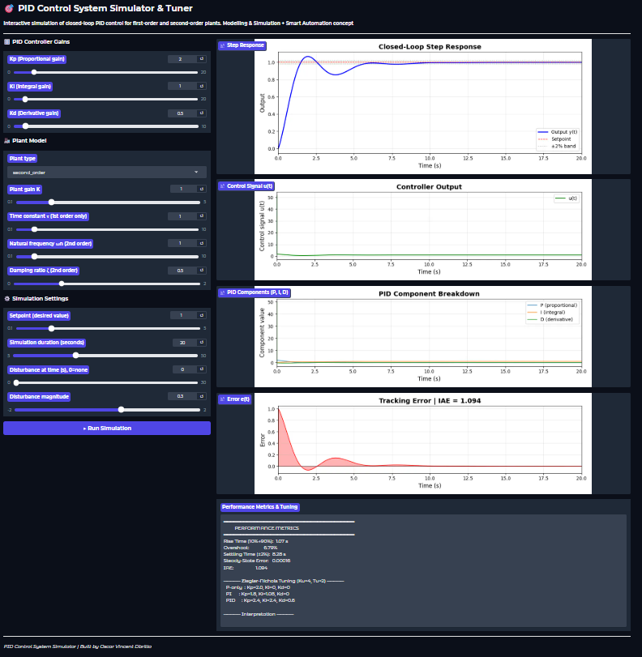
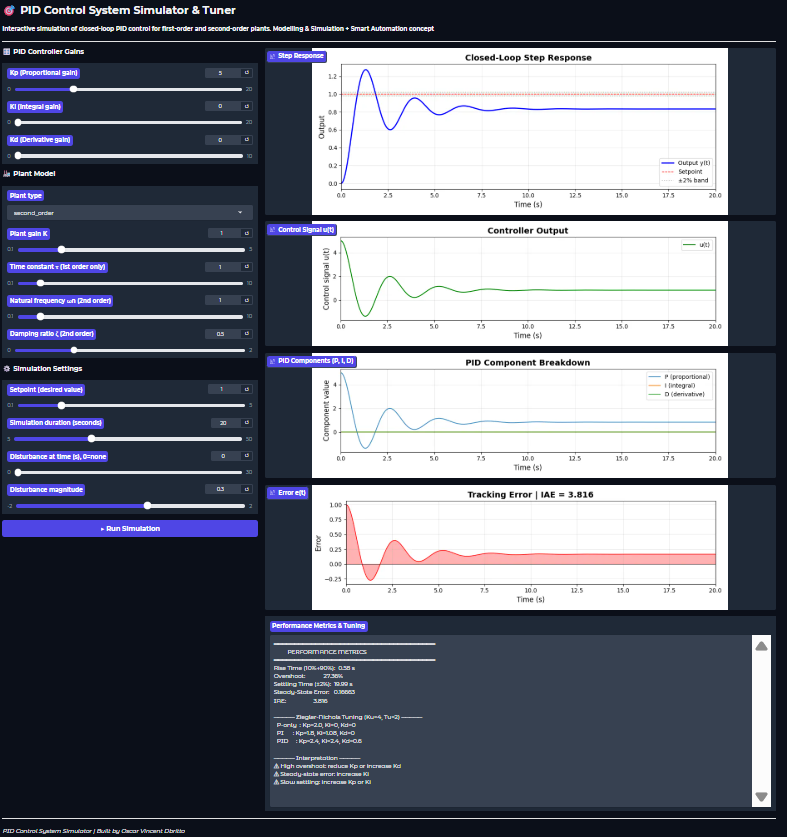
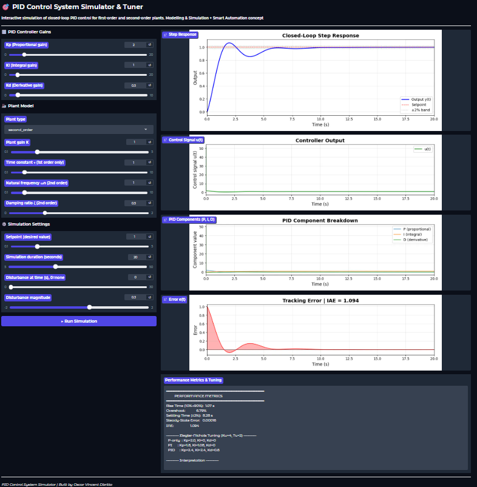

# 🎯 PID Control System Simulator & Tuner
 

 
## Overview
Interactive PID controller simulator for first-order and second-order
plant models. Built with **Gradio** and deployed on **HuggingFace Spaces**.
 
Visualizes closed-loop step response, control signal, PID component
breakdown (P/I/D separately), and tracking error.
 
## 🔗 Live Demo
**[▶ Open Simulator on HuggingFace](https://huggingface.co/spaces/Oscar0806/pid-control-simulator)**
 
## Features
| Feature | Description |
|---------|-------------|
| PID Controller | Kp/Ki/Kd gains with anti-windup |
| Plant Models | First-order (τ) and second-order (ωn, ζ) |
| Step Response | Blue output vs red setpoint with ±2% band |
| Control Signal | Controller output u(t) over time |
| PID Breakdown | P, I, D components plotted individually |
| Error Tracking | Shaded error plot with IAE metric |
| Auto-Tuning | Ziegler-Nichols ultimate gain method |
| Disturbance | Inject step disturbance at configurable time |
| Metrics | Rise time, overshoot, settling time, SS error, IAE |
 
## Test Scenarios
| Scenario | Settings | Result |
|----------|----------|--------|
| P-only | Ki=0, Kd=0 | Steady-state error visible |
| PI | Kd=0 | Zero SS error, more overshoot |
| Full PID | Default | Balanced speed and stability |
| Disturbance | t=10s, mag=0.5 | Controller rejects disturbance |
| Underdamped | ζ=0.1 | Oscillatory response |
 
 
## Screenshots
| Default PID | P-Only (SS Error) | Disturbance Rejection |
|:-----------:|:-----------------:|:---------------------:|
|  |  |  |
 
## How to Run Locally
```bash
pip install gradio numpy scipy matplotlib
python app.py
```
 
## Author
**Oscar Vincent Dbritto**
[LinkedIn](https://linkedin.com/in/oscar-dbritto)
[Portfolio](https://oscardbritto.framer.website/)
